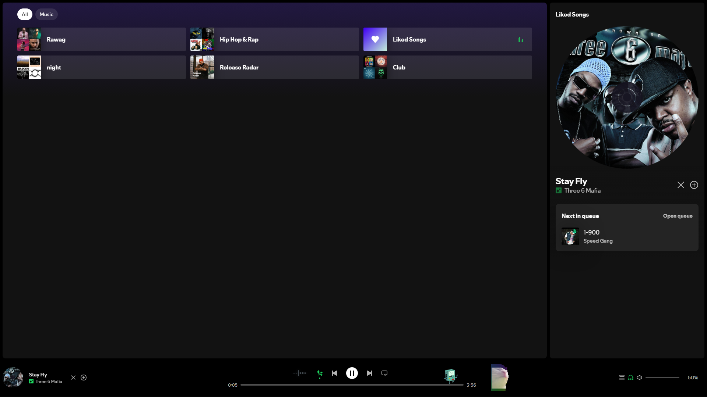

<h1 align="center">Auto-Skip Liked Songs for Spicetify</h1>

<p align="center">
  
  
  
</p>
A powerful Spicetify extension that adds a native-looking toggle button next to your Volume/Mute controls. When turned ON, it automatically skips any song currently playing that is already saved to your Liked Songs (indicated by the Green Checkmark).

This extension is built specifically to survive Spotify's recent UI updates. It uses a brute-force UI watcher to guarantee functionality, even when internal APIs change.

## Features
*   **Playbar Integration:** A clean, native-looking toggle button Injected securely next to the Mute button on the right side.
*   **Visual Feedback:** The icon turns Green when active and displays popup notifications so you always know its status.
*   **Custom SVG Icon:** Features a clean, custom-designed "Curved Arrow over Dots" icon that fully supports Spotify's native hover and active color states.
*   **Smart Memory:** Built with LocalStorage. It remembers if you left it ON or OFF, even after you restart Spotify.
*   **Adjustable Speed (Right-Click):** 
    *    **Safe Mode (Default):** Waits 1.5 seconds before skipping to protect your Spotify account from rate-limiting/server bans.
    *    **Fast Mode:** Right-click the icon to lower the delay to 0.5s (just enough time for the UI to load) and skip instantly!

---

<p align="center">
  <b>Marketplace Banner</b><br><br>
  
</p>

<br>

<p align="center">
  <b>In-App Location</b><br><br>
  
</p>

---

## Installation

Search for **"Auto-Skip Liked Songs"** in the official Spicetify Marketplace and click install!"

or the manual way:

1. Download the `auto-skip-toggle.js` file from this repository.
2. Place the file inside your Spicetify `Extensions` folder:
   *   **Windows:** `%appdata%\spicetify\Extensions`
   *   **Mac/Linux:** `~/.config/spicetify/Extensions`
3. Open your Terminal or PowerShell and run the following commands to apply it:
   ```bash
   spicetify config extensions auto-skip-toggle.js
   spicetify apply

(Note: If your os forces Administrator mode, use spicetify apply --bypass-admin instead).

## Usage

1. Open Spotify and and look at the far right of your Playbar (next to the volume slider).
2. Locate the new **Skip Icon** next to the Mute button.
3. Left-Click to turn Auto-Skip ON (The icon will turn Green).
4. Right-Click to toggle between Safe Mode (1.5s) and Fast Mode (0.5s).
5. Whenever a song with a Green Checkmark plays, the extension will wait Safe Mode (1.5s) or Fast Mode (0.5s) and automatically skip to the next track.
6. Left-Click the icon again to turn Auto-Skip **OFF**.
